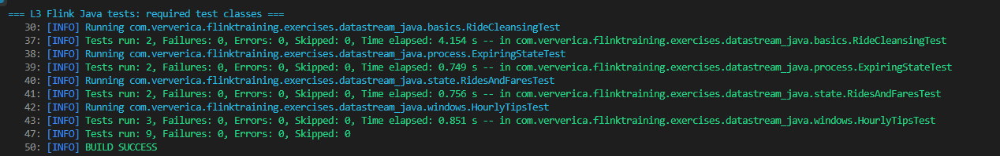

# Отчет по лабораторной работе 3

## Тема

Потоковая обработка данных в Apache Flink. Выполнение Java-упражнений из проекта `flink-training-exercises`.

## Цель работы

Цель лабораторной работы - познакомиться с потоковой обработкой данных в Apache Flink и реализовать несколько типовых задач обработки событий на Java.

## Постановка задачи

По заданию необходимо выполнить четыре упражнения из репозитория Ververica Flink Training Exercises:

1. `RideCleanisingExercise`;
2. `RidesAndFaresExercise`;
3. `HourlyTipsExerxise`;
4. `ExpiringStateExercise`.

В исходном проекте названия Java-файлов отличаются от формулировок в задании:

- `RideCleanisingExercise` соответствует файлу `RideCleansingExercise.java`;
- `HourlyTipsExerxise` соответствует файлу `HourlyTipsExercise.java`.

Решение должно быть выполнено на Java. Для проверки используются тесты из проекта.

## Подготовка проекта

Для выполнения лабораторной работы был использован проект:

```text
L3 - Stream processing with Apache Flink/flink-training-exercises
```

В `ExerciseBase.java` настроены пути к данным:

```text
../../data/nycTaxiRides.gz
../../data/nycTaxiFares.gz
```

Эти файлы находятся в общей папке `data` репозитория.

## Особенности запуска

Проект `flink-training-exercises` использует старую версию Flink. Для запуска на JDK 17 потребовались технические изменения в `pom.xml`.

Были выполнены следующие настройки:

- обновлен `maven-surefire-plugin`;
- добавлены JVM-параметры `--add-opens` и `--add-exports`;
- отключена Scala-компиляция, так как лабораторная выполняется на Java;
- удалена неразрешимая зависимость `flink-table_2.11`;
- тесты запускаются с `-Dcheckstyle.skip=true`, так как в исходном проекте есть checkstyle-нарушения, не относящиеся к реализуемым заданиям.

## Реализованные задания

### RideCleansingExercise

Задача заключается в фильтрации потока поездок такси.

В поток должны попадать только поездки, у которых:

- начальная точка находится в Нью-Йорке;
- конечная точка находится в Нью-Йорке.

Для проверки координат используется `GeoUtils.isInNYC`.

Реализован фильтр `NYCFilter`, который проверяет координаты начала и конца поездки.

### RidesAndFaresExercise

Задача заключается в соединении двух потоков:

- поток поездок `TaxiRide`;
- поток оплат `TaxiFare`.

События соединяются по `rideId`.

Так как события из разных потоков могут приходить в разном порядке, используется keyed state:

- `ValueState<TaxiRide>` для временного хранения поездки;
- `ValueState<TaxiFare>` для временного хранения оплаты.

Если для пришедшей поездки уже есть оплата, формируется результат и состояние очищается. Если оплаты еще нет, поездка сохраняется в state. Аналогично работает обработка оплаты.

### HourlyTipsExercise

Задача заключается в вычислении водителя, получившего максимальную сумму чаевых за каждый час.

Реализация состоит из двух оконных этапов:

1. Сначала поток оплат группируется по `driverId`, после чего в часовом окне считается сумма чаевых каждого водителя.
2. Затем по всем водителям выбирается запись с максимальной суммой чаевых за этот час.

Результат представлен как `Tuple3`:

```text
windowEnd, driverId, totalTips
```

### ExpiringStateExercise

Задача похожа на соединение поездок и оплат, но требуется дополнительно учитывать устаревшее состояние.

Используется `KeyedCoProcessFunction`, keyed state и event-time таймеры.

Для каждого `rideId` хранятся:

- ожидающая поездка;
- ожидающая оплата.

Если парное событие приходит вовремя, формируется результат и соответствующее состояние очищается. Если парное событие не приходит до таймера, несопоставленное событие отправляется в side output:

- unmatched rides;
- unmatched fares.

## Использованные технологии

- Java 17;
- Apache Flink;
- Maven;
- JUnit 4;
- Flink test harness.

Spring Boot не использовался, потому что задания являются потоковыми Flink job-ами, а не веб-сервисами.

## Проверка работы

Запускались Java-тесты, соответствующие четырем заданиям лабораторной работы.

Команда запуска:

```powershell
$env:JAVA_HOME=(Resolve-Path '..\..\jdk-17.0.18+8')
$env:PATH="$env:JAVA_HOME\bin;$env:PATH"
..\..\apache-maven-3.8.9\bin\mvn.cmd "-Dmaven.repo.local=.m2" "-Dcheckstyle.skip=true" "-Dtest=RideCleansingTest,RidesAndFaresTest,HourlyTipsTest,ExpiringStateTest" test
```

Фактический результат последнего запуска:

```text
Tests run: 9, Failures: 0, Errors: 0, Skipped: 0
BUILD SUCCESS
```

Материалы проверки сохранены в репозитории:

- лог Java-тестов Flink: `reports/evidence/lab3_flink_java_tests.log`;
- скриншот: `reports/evidence/screenshots/lab3/lab3_flink_tests.png`.

Проверка скриншота:

- `lab3_flink_tests.png` показывает запуск `RideCleansingTest`, `ExpiringStateTest`, `RidesAndFaresTest`, `HourlyTipsTest`, итог `Tests run: 9`, `Failures: 0`, `Errors: 0` и `BUILD SUCCESS`.

Скриншот:



## Результат работы

В результате были реализованы четыре потоковые задачи:

- фильтрация поездок по географической области;
- соединение двух потоков с использованием состояния;
- оконная агрегация чаевых;
- соединение потоков с очисткой устаревшего состояния и side outputs.

## Ограничения и замечания

Реализована Java-часть лабораторной. Scala-часть проекта отключена для совместимости с JDK 17 и потому, что по условию разрешено выполнять задания на Java.

Checkstyle пропускается при запуске тестов, так как исходный учебный проект содержит дополнительные файлы и примеры, не относящиеся к выполненным заданиям.

## Вывод

Лабораторная работа выполнена полностью. Все четыре требуемых упражнения реализованы на Java, а корректность подтверждена тестами Flink.
